# Comparative Analysis of Lightweight Deep Learning Models for Traffic Sign Recognition

**Author:** Shakil Ahammed (Roll: 2114058 | Reg: 1123)
**Supervisor:** Dr. Bappa Sarkar (Associate Professor)
**Department:** Computer Science and Engineering, Islamic University, Bangladesh

---

## Abstract

Traffic sign recognition (TSR) is a core building block of self-driving cars and driver-assistance systems, but it faces a fundamental trade-off: the most accurate deep learning models tend to be large and slow, while models small enough for embedded hardware often sacrifice accuracy.

This project trains and evaluates **four models** on the GTSRB dataset — a **Custom CNN** built from scratch, and three well-known lightweight architectures used via transfer learning: **MobileNetV2**, **MobileNetV3-Small**, and **EfficientNet-B0**. All models are compared on accuracy, precision, recall, F1-score, parameter count, model size, and inference time.

**Key finding:** the small Custom CNN, trained from scratch, achieved the **highest accuracy of all four models (99.36%)** while also having the fewest parameters and the smallest file size. Among the pretrained lightweight models, **MobileNetV2** gave the best balance of accuracy and efficiency.

---

## 1. Introduction

TSR is the task of identifying a traffic sign's meaning from a camera image, and it underpins Advanced Driver Assistance Systems (ADAS) and autonomous vehicles. CNNs are the standard approach, but the most accurate ones are typically deep and heavy — a poor fit for onboard computers, microcontrollers, or edge devices.

"Lightweight" architectures such as MobileNet and EfficientNet were developed to preserve most of the accuracy of large CNNs while sharply cutting parameters and compute. This project asks: **how much accuracy is gained or lost using lightweight architectures compared to a small custom CNN, and how do the lightweight models compare to each other in size and speed?**

### 1.1 Objectives
1. Train and evaluate Custom CNN, MobileNetV2, MobileNetV3-Small, and EfficientNet-B0 on GTSRB.
2. Measure accuracy, precision, recall, and F1-score on a held-out test set.
3. Measure parameter count, model size, and inference time per image.
4. Identify the most suitable model per deployment priority (accuracy, footprint, or speed).

---

## 2. Related Work

- **Classical approaches:** hand-crafted features (e.g., HOG) with SVM classifiers — sensitive to lighting, occlusion, and viewpoint changes.
- **CNN-based classification:** learned features outperform hand-designed ones; multi-column CNN ensembles have exceeded human performance on GTSRB, suggesting GTSRB is not especially difficult once a model has sufficient capacity.
- **Lightweight architectures:**
  - **MobileNetV1/V2** — depthwise separable convolutions; V2 adds inverted residual blocks with linear bottlenecks.
  - **MobileNetV3** — neural architecture search (NAS) + NetAdapt, with h-swish activation.
  - **EfficientNet-B0** — compound scaling of depth, width, and resolution.

These three families represent distinct design philosophies, making the comparison meaningful rather than arbitrary.

---

## 3. Methodology

### 3.1 Dataset — GTSRB

The German Traffic Sign Recognition Benchmark contains 50,000+ labelled images across 43 classes (speed limits, warnings, prohibitions, mandatory, priority signs), collected from real traffic environments with natural variation in lighting, blur, resolution, and angle.

*(Sample images from the GTSRB dataset — see `dataset/GTSRB/Meta/` in this repo for class icons)*

**Class imbalance** is notable: some classes have ~1,800–2,000 training images, others only ~150–200 — roughly a 10x difference. This is why the study reports precision/recall/F1 alongside accuracy.

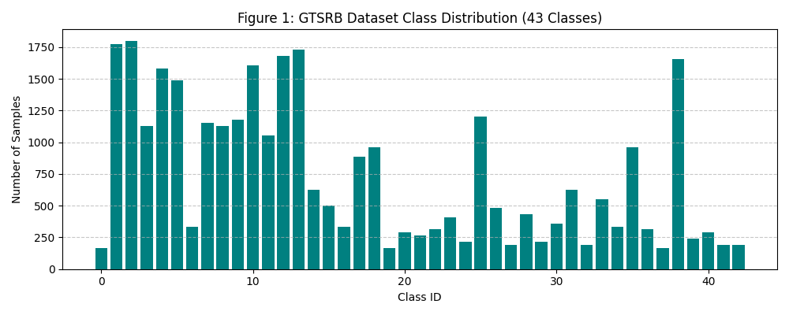

### 3.2 Preprocessing & Data Split

- All images resized to **64×64×3** and normalized.
- Training-set-only augmentation: random rotation, color jittering, random scaling.

| Split | Percentage |
|---|---|
| Training | 70% |
| Validation | 15% |
| Testing | 15% |

The test split was held out entirely until final evaluation.

### 3.3 Model Architectures

| Model | Total Parameters | Trainable Parameters | Model Size (MB) |
|---|---|---|---|
| Custom CNN | 1,147,499 | 1,147,499 (from scratch) | 4.38 |
| MobileNetV2 | 2,278,955 | 1,736,427 | 8.93 |
| MobileNetV3-Small | 1,561,931 | 1,371,411 | 6.09 |
| EfficientNet-B0 | 4,062,631 | 3,210,823 | 15.79 |

- **Custom CNN:** 3 conv blocks + max-pooling, dropout (0.5) before the final dense layer, trained entirely from scratch.
- **MobileNetV2:** depthwise separable convolutions + inverted residuals/linear bottlenecks, ImageNet-pretrained.
- **MobileNetV3-Small:** NAS-optimized, h-swish + squeeze-and-excite modules; smallest of the pretrained models.
- **EfficientNet-B0:** MBConv blocks with compound scaling; largest model in this comparison.

### 3.4 Training Configuration

| Model | Epochs | Total Training Time (s) |
|---|---|---|
| Custom CNN | 14 | 809.06 |
| MobileNetV2 | 10 (5+5) | 566.33 |
| MobileNetV3-Small | 10 (5+5) | 554.10 |
| EfficientNet-B0 | 10 (5+5) | 596.48 |

- Custom CNN trained from scratch until validation loss plateaued.
- Transfer-learning models used a **two-phase strategy**: 5 epochs head-only training (backbone frozen, lr=1e-3), then 5 epochs full fine-tuning (lr=1e-4).
- Shared settings: 64×64×3 input, batch size 32, Adam optimizer, categorical cross-entropy loss.

---

## 4. Results

### 4.1 Classification Performance

| Model | Accuracy | Precision | Recall | F1-Score |
|---|---|---|---|---|
| **Custom CNN** | **99.36%** | 0.9937 | 0.9936 | 0.9936 |
| MobileNetV2 | 94.24% | 0.9442 | 0.9424 | 0.9425 |
| EfficientNet-B0 | 92.78% | 0.9312 | 0.9278 | 0.9282 |
| MobileNetV3-Small | 90.33% | 0.9075 | 0.9033 | 0.9032 |

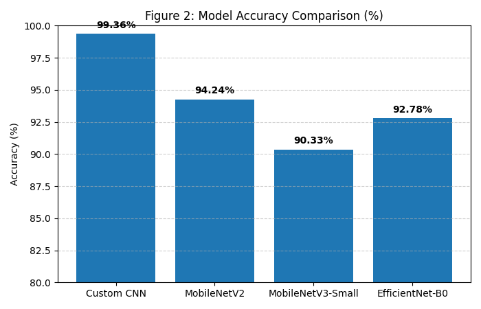

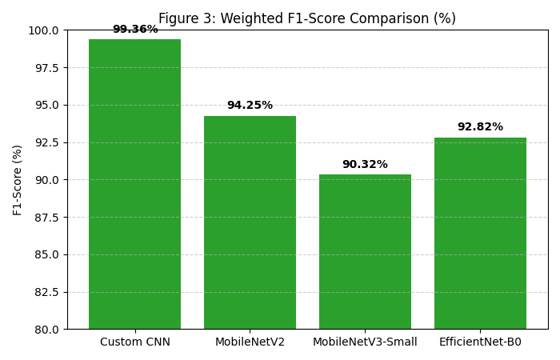

The F1-score ranking matches the accuracy ranking exactly — performance is consistent across metrics, not just driven by majority classes.

### 4.2 Computational Efficiency

| Model | Parameters | Model Size | Inference Time (per image) |
|---|---|---|---|
| Custom CNN | 1.15 M | 4.38 MB | 1.174 ms |
| MobileNetV3-Small | 1.56 M | 6.09 MB | 1.087 ms |
| MobileNetV2 | 2.28 M | 8.93 MB | 1.089 ms |
| EfficientNet-B0 | 4.06 M | 15.79 MB | 1.356 ms |

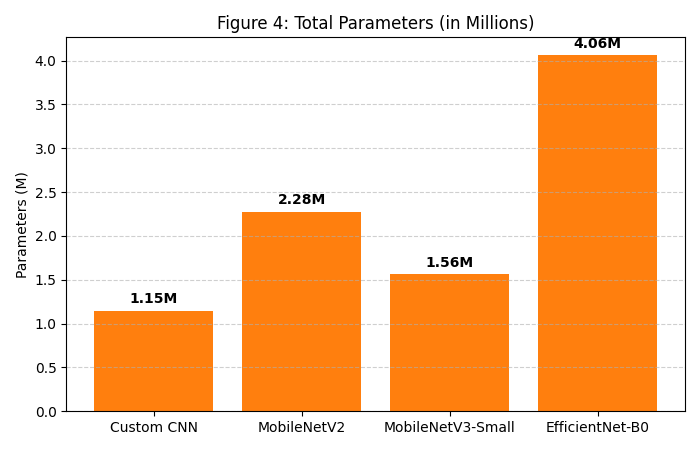

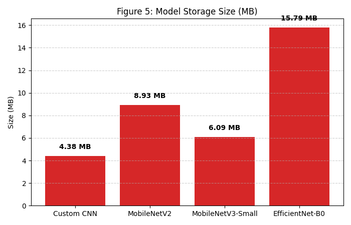

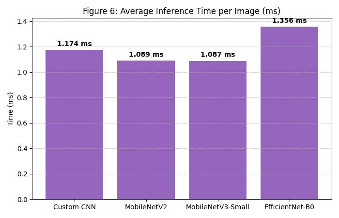

Model size doesn't always predict inference speed: the Custom CNN is smallest but slightly slower than both MobileNet variants, while EfficientNet-B0 is both the largest and the slowest. All four models are fast enough for real-time use.

### 4.3 Training Behavior

| Model | Training Curve Summary |
|---|---|
| **Custom CNN** | 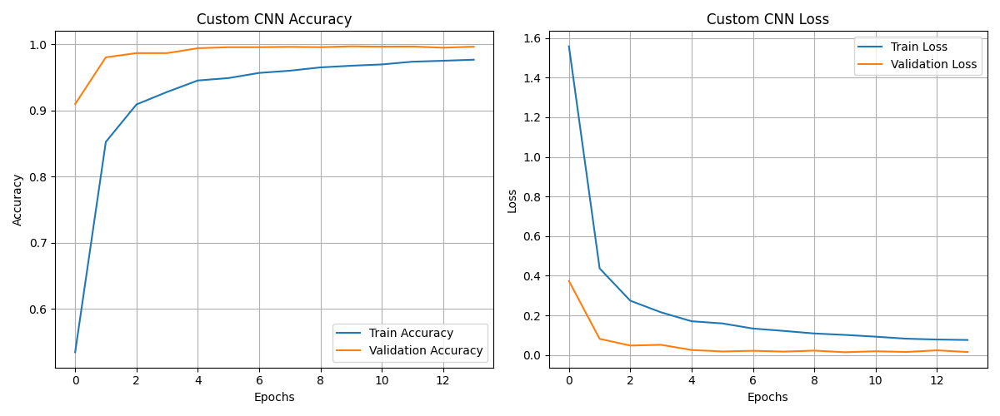 Accuracy improved quickly in the first 2 epochs, reaching ~99.6% validation accuracy; low validation loss suggests dropout controlled overfitting. |
| **MobileNetV2** | 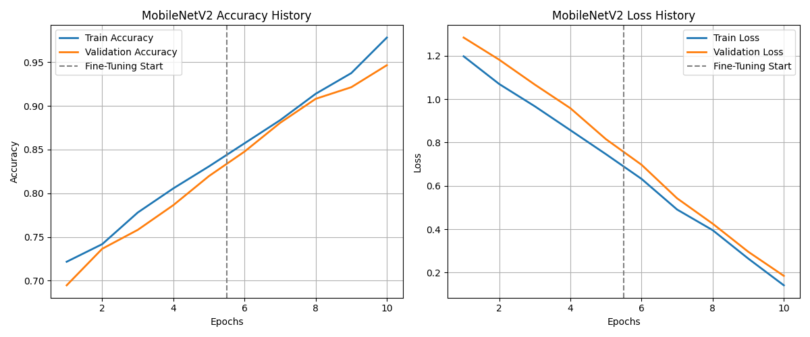 Steady rise across both phases, with a visible dip at the fine-tuning transition (epoch 5); had not fully plateaued by epoch 10. |
| **MobileNetV3-Small** | 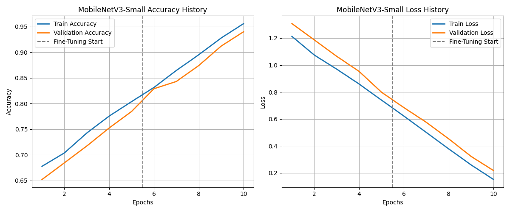 Similar pattern to MobileNetV2 but starting and finishing lower; small train/val gap suggests the lower accuracy is an architecture limitation, not overfitting. |
| **EfficientNet-B0** | 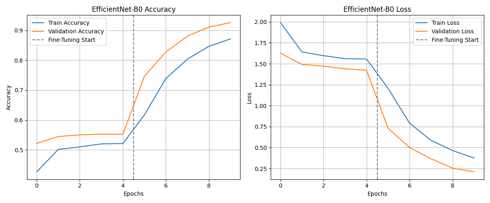 Still clearly improving at epoch 10 — likely under-trained; its 92.78% final accuracy probably understates its true potential. |

### 4.4 Confusion Matrix of the Best Model

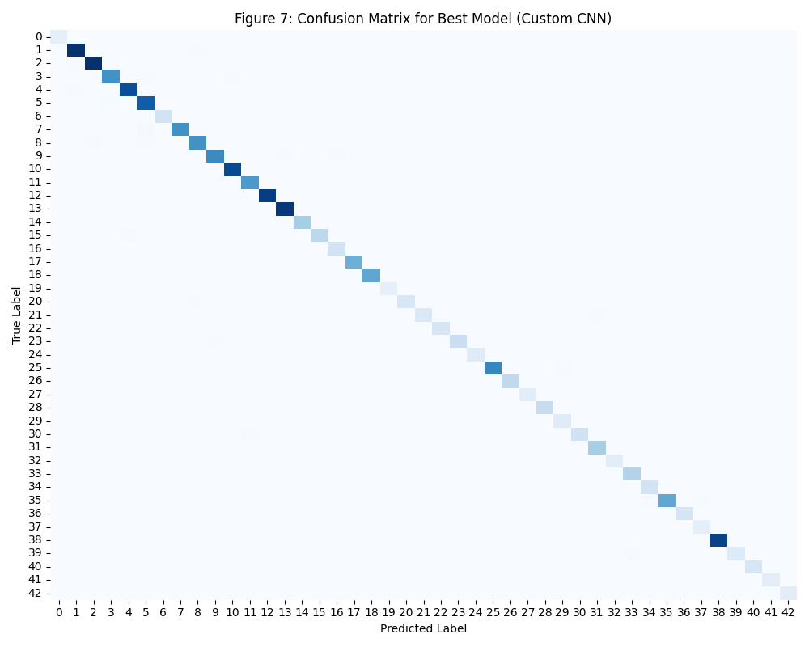

The matrix is almost entirely diagonal — the Custom CNN correctly classifies nearly all classes, with the few errors occurring mostly between visually similar signs (e.g., different speed limits).

---

## 5. Discussion

The Custom CNN outperformed all three pretrained models — surprising, since transfer learning usually helps with limited data. Several factors explain this:

- **Task narrowness:** GTSRB's 43 classes are simple shapes (circles, triangles) in a limited color palette — quite different from ImageNet's 1,000 varied categories. ImageNet-pretrained features aren't necessarily well-suited to this narrower domain, and prior work shows pretrained features can transfer poorly when the target task differs enough and sufficient target-domain data exists.
- **Sufficient data:** GTSRB's 50,000+ images give a small CNN enough signal to learn useful features from scratch.
- **Training budget:** the Custom CNN trained for 14 epochs until convergence, while pretrained models were capped at 10 epochs. EfficientNet-B0 in particular was still improving when training stopped, so its 92.78% likely understates its ceiling — this is a limitation of the experimental setup, not proof the architecture is worse.

Among the three pretrained models, **MobileNetV2** gave the best overall balance (94.24% accuracy, 8.93 MB, ~1.09 ms inference). **MobileNetV3-Small** was smaller and marginally faster but less accurate — consistent with its design goal of extreme compactness. **EfficientNet-B0**, despite being the most complex model, gave no accuracy advantage here, likely due to the limited training budget.

Inference times were all close (1.09–1.36 ms), and model size didn't scale linearly with speed — different architectures use their parameters differently (depthwise separable convolutions vs. MBConv blocks), and actual runtime depends on hardware efficiency for each op type.

These results reflect performance on the **clean GTSRB test split** only. Prior work shows TSR accuracy can degrade under real-world perturbations (shadows, uneven lighting, partial occlusion), which were not evaluated here — so this ranking may not fully generalize to harsher driving conditions.

---

## 6. Conclusion

There is no single best model — the right choice depends on deployment priorities:

- **Highest accuracy, small footprint → Custom CNN.** 99.36% accuracy, 1.15M parameters, 4.38 MB — outperformed all pretrained models despite training from scratch.
- **Best pretrained/transferable option → MobileNetV2.** 94.24% accuracy with fast inference and moderate size; a practical choice if the model needs to adapt to other vision tasks later.
- **Most resource-constrained deployment → MobileNetV3-Small.** Lower accuracy, but smallest and fastest among the pretrained models.
- **EfficientNet-B0 underperformed** in this experiment, most likely due to a limited training budget rather than an architectural shortcoming.

**Overall takeaway:** being lightweight or pretrained doesn't automatically make a model better. For a focused, well-structured task like traffic sign recognition, a small CNN trained from scratch — given enough data and suitable training — can outperform larger, pretrained architectures.

---

## References

1. N. Dalal and B. Triggs, "Histograms of oriented gradients for human detection," *CVPR*, 2005.
2. J. Stallkamp et al., "Man vs. computer: Benchmarking machine learning algorithms for traffic sign recognition," *Neural Networks*, 32:323–332, 2012.
3. Y. LeCun et al., "Gradient-based learning applied to document recognition," *Proceedings of the IEEE*, 86(11):2278–2324, 1998.
4. D. Cireşan et al., "Multi-column deep neural network for traffic sign classification," *Neural Networks*, 32:333–338, 2012.
5. A. G. Howard et al., "MobileNets: Efficient Convolutional Neural Networks for Mobile Vision Applications," *arXiv:1704.04861*, 2017.
6. M. Sandler et al., "MobileNetV2: Inverted Residuals and Linear Bottlenecks," *CVPR*, 2018.
7. A. Howard et al., "Searching for MobileNetV3," *ICCV*, 2019.
8. M. Tan and Q. V. Le, "EfficientNet: Rethinking Model Scaling for Convolutional Neural Networks," *ICML*, 2019.
9. C. Shorten and T. M. Khoshgoftaar, "A survey on Image Data Augmentation for Deep Learning," *Journal of Big Data*, 6(60), 2019.
10. N. Srivastava et al., "Dropout: A Simple Way to Prevent Neural Networks from Overfitting," *JMLR*, 15:1929–1958, 2014.
11. J. Hu, L. Shen, and G. Sun, "Squeeze-and-Excitation Networks," *CVPR*, 2018.
12. D. P. Kingma and J. Ba, "Adam: A Method for Stochastic Optimization," *ICLR*, 2015.
13. J. Yosinski et al., "How transferable are features in deep neural networks?," *NeurIPS*, 2014.
14. M. A. Khan et al., "Traffic Sign Recognition Under Visual Perturbations: Shadows, Light Patches, and Simulated Obstructions," *CVPRW*, 2025.
15. M. A. Khan et al., "A Lightweight CNN Architecture for Traffic Sign Recognition in Urban Road Networks," *Electronics*, 12(8):1802, 2023.
